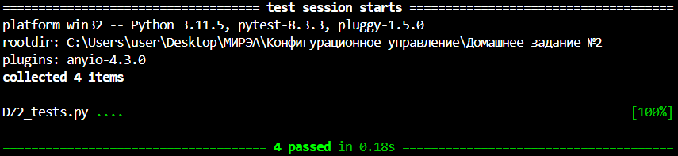

### 1. **Общее описание**
Данный проект предназначен для визуализации графа зависимостей пакетов, используя модуль pip для получения информации о зависимостях.
Этот проект состоит из двух основных файлов: `DZ2.py` и `DZ2_tests.py`. 

Файл `DZ2.py` является главной программой в проекте, она визуализирует граф зависимостей пакетов. Зависимости определяются по имени пакета языка Python (pip). Для
описания графа зависимостей используется представление Graphviz.
Визуализатор должен выводить результат на экран в виде графического
изображения графа.

Файл `DZ2_tests.py` содержит набор тестов для проверки работоспособности функций, реализованных в `DZ2.py`. Тесты запускают сценарии для проверки работы функций, таких как `get_dependencies`, `build_dependency_graph`, `visualize_graph`.

### 2. **Описание всех функций и настроек**
#### Файл `DZ2.py`:


- **`get_dependencies(package_name)`**  
  - Данная функция получает зависимости указанного пакета с использованием команды pip show. Возвращает список зависимостей (пакетов), если они есть, иначе — пустой список.
  - Сначала данная функция выполняет команду pip show <package_name> и проверяет код возврата. Далее парсит вывод, чтобы найти строку, начинающуюся с `Requires:`, если зависимости найдены, они добавляются в список, который возвращается.
  

- **`build_dependency_graph(package_name, visited=None)`**  
  - Данная функция рекурсивно строит граф зависимостей для указанного пакета. Возвращает ключи — имена пакетов, значения — их зависимости.
  - Сначала идет проверка был ли пакет уже установлен (для избежания зацикливания). После этого, идет получение зависимостей с помощью `get_dependencies`. В конце, функция добавляет текущий пакет и его зависимости в граф и рекурсивно обрабатывает каждую зависимость.

- **`visualize_graph(graph)`**  
  - Данная функция создает визуальное представление графа зависимостей с использованием Graphviz. Возвращает объект `graphviz.Digraph`, который можно использовать для визуализации.
  - Сначала идет создание нового графа, после, для каждого пакета и его зависимостей добавляет ребра (связи) в граф.

#### Файл `DZ2_tests.py`:
- **Тестовые функции**  
  Набор функций для тестирования каждой функции программы:
  - `test_get_dependencies_success()` и `test_get_dependencies_failure()` проверяют правильность получения зависимостей указанного пакета с использованием команды pip show,
  - `test_build_dependency_graph()` тестируют корректность построенного графа зависимостей для указанного пакета,
  - `test_visualize_graph()` проверяет правильность графа зависимостей, построенного с помощью Graphviz .

### 3. **Описание команд для сборки проекта**

1. Для запуска основного скрипта `DZ2.py`:
   ```
   py DZ2.py "graph" "matplotlib" "https://github.com/KapRun17/Config-HW2"
   ```

2. Для запуска скрипта с тестами `DZ2_tests.py`:
   ```
   python -m pytest DZ2_tests.py
   ```
   Этот скрипт запускает все тесты, проверяющие работоспособность функций.

### 4. **Результаты прогона тестов**
  Результаты прогона тестов

  Граф зависимостей для пакета `matplotlib`

  Граф зависимостей для пакета `matplotlib`, построенный с помощью `Graphviz`

